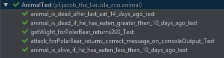

# SDA - zoo

projekt wykonany na zajęciach z programowania średnio-zaawansowanego

## testy jednostkowe


### testowanie konsoli
testowanie danych rzucanych na konsolę

``` java
    private final PrintStream orginalOut = System.out;

    @Before
    public void setUp() {
        System.setOut(new PrintStream(outContent));
    }
    
    @Test
    public void attack_for_PolarBear_returns_CorrectMessageOnConsoleOutput_Test() {
        ILivingBear bear = new PolarBear(dateProvider);
        String expected = KILL_FOR_FOOD;

        bear.attack();
        String actual = outContent.toString().trim();

        assertEquals(expected, actual);
    }    
    
    @After
    public void tearDown(){
        System.setOut(orginalOut);
    }    
```


### mockito
testowanie ze wstrzykiwaniem zależności

```java
    private final IDateProvider dateProvider = mock(IDateProvider.class);

    @Test
    public void animal_is_alive_if_he_has_eaten_less_then_10_days_ago_test() {
        LocalDateTime date = LocalDateTime.now().minusDays(9);
        Mockito.when(dateProvider.getDateTime()).thenReturn(date);
        IAnimal bear = new BrownBear(dateProvider);

        boolean isAlive =   bear.isAlive();

        assertTrue(isAlive);
    }
```

### result



## logowanie
logowanie zdarzeń wykonywanych w aplikacji przy użyciu logback

przykładowa deklaracja klasy logującej
``` java
    private static final Logger log = LoggerFactory.getLogger(MyClass.class);
```

użycie w celu zalogowania, odpowiedni poziom

``` java
    log.debug("debug message");
    log.trace("trace message");
    log.info("info message");
    log.warn("warning message");
    log.error("error message");
```

przykład
``` java
    private void printAnimalDetails() {
        log.debug("printAnimalDetails()");
        zoo.getAnimalsCount()
                .forEach((name, cnt) -> printAnimalDetailItem(name, cnt));
    }
```

przykładowy plik konfiguracyjny
``` xml
<configuration scan="true">
    <property name="ERROR_LOG" value="logs/%d{yyyy-MM-dd}-error.log"/>
    <property name="MESSAGE_PATTERN" value="%d{HH:mm:ss.SSS} [%thread] %-5level %logger{36} - %msg%n"/>
    
    <appender name="FILE-error" class="ch.qos.logback.core.rolling.RollingFileAppender">
        <rollingPolicy class="ch.qos.logback.core.rolling.TimeBasedRollingPolicy">
            <fileNamePattern>${ERROR_LOG}</fileNamePattern>
            <maxHistory>30</maxHistory>
            <totalSizeCap>3GB</totalSizeCap>
        </rollingPolicy>
        
        <triggeringPolicy class="ch.qos.logback.core.rolling.SizeBasedTriggeringPolicy">
            <maxFileSize>50MB</maxFileSize>
        </triggeringPolicy>
        
        <encoder>
            <pattern>${MESSAGE_PATTERN}</pattern>
        </encoder>
        
        <filter class="ch.qos.logback.classic.filter.LevelFilter">
            <level>ERROR</level>
            <onMatch>ACCEPT</onMatch>
            <onMismatch>DENY</onMismatch>
        </filter>
    </appender>
    
    <root level="debug">
        <appender-ref ref="FILE-error" />
    </root>
</configuration>
```
wynik zapisany w przykładowym pliku z użyciem warn i info w appenderze
```
10:45:55.295 [main] INFO  p.j.sda_zoo.ZooApplication - application lunched
10:45:57.966 [main] INFO  p.j.sda_zoo.ZooApplication - user input: 'help'
10:45:57.968 [main] WARN  p.j.sda_zoo.ZooApplication - invalid choice: help
10:46:07.864 [main] INFO  p.j.sda_zoo.ZooApplication - user input: 'duck'
10:46:07.865 [main] WARN  p.j.sda_zoo.ZooApplication - invalid choice: duck
10:46:12.696 [main] INFO  p.j.sda_zoo.ZooApplication - user input: 'quit'
10:46:12.700 [main] INFO  p.j.sda_zoo.ZooApplication - application finish
```